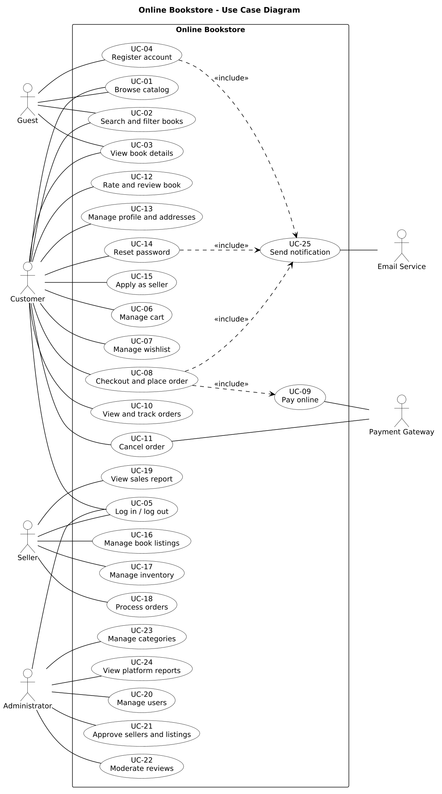
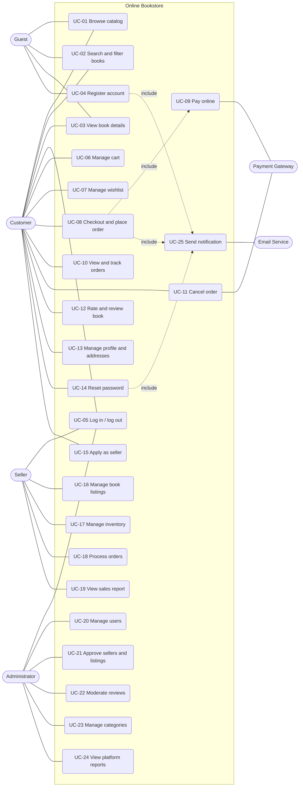
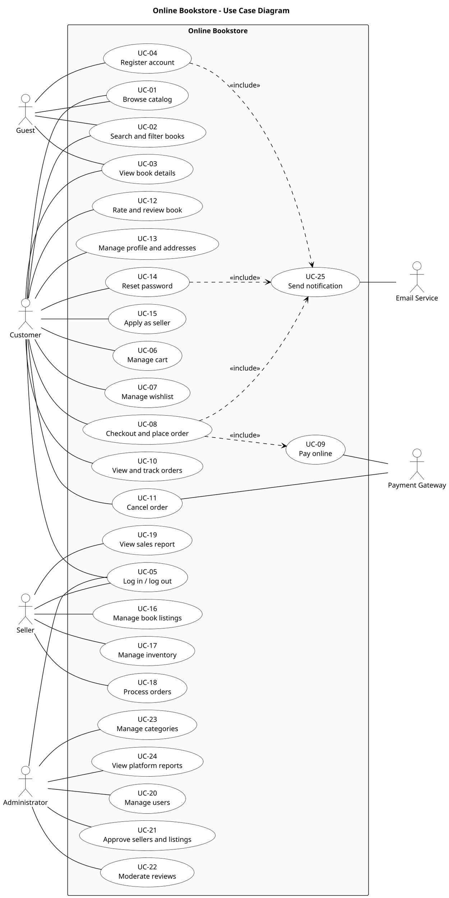

# 1. Cover Page

 

**ONLINE BOOKSTORE**

**An E-Commerce Platform for Buying and Selling Books Online**

 

**Phase 1: Requirements**
Software Requirements Specification and Validation Specification (Planning)

 

| | |
|---|---|
| **Members** | Anagha N (PES1UG24CS058) Manasvi B (PES1UG24CS261) Meda Sahasra Siri (PES1UG24CS267) Monika (PES1UG24CS274) |
| **Course** | Software Engineering |
| **Technology Stack** | MERN (MongoDB, Express.js, React, Node.js) |
| **Repository** | https://github.com/Ana-9211/Software-Engineering-Project- |
| **Document Version** | 1.0 (Phase 1 submission) |

# 2. Problem Statement Analysis and Feasibility

## 2.1 Problem Statement

Readers who buy books online mostly depend on a few large marketplaces, where niche titles are hard to find. Independent sellers and small bookstores lack an inexpensive channel for listing stock and reaching buyers. Online Bookstore is a web platform on which customers discover, purchase and review physical books, sellers list and fulfil them, and administrators govern the platform.

## 2.2 Scope

**In scope:** catalog browsing and search; user accounts; cart and wishlist; checkout with online payment; order tracking and cancellation; ratings and reviews; seller registration, listings, inventory and order processing; administrator moderation and reporting; email notifications.

**Out of scope (this release):** e-books and audio books, native mobile applications, multiple currencies, recommendation engine, live chat.

## 2.3 Feasibility Analysis

| Dimension | Assessment | Conclusion |
|---|---|---|
| Technical | MERN is a mature stack and the team works in JavaScript. Payment providers offer a test (sandbox) mode. The main technical challenge is consistent stock updates under concurrent orders, which MongoDB transactions address. | Feasible |
| Economic | The planned tooling (MongoDB Atlas free tier, free-tier hosting, payment sandbox, open-source test tools) has no licence cost. | Feasible |
| Schedule | Five course phases with fixed due dates. Requirements carry MoSCoW priorities so that Could/Should items can be deferred if the schedule tightens. | Feasible with scope control |
| Operational | Standard e-commerce interaction model with three user roles; no special training required. | Feasible |
| Legal and security | Card data is handled by the payment gateway and is never stored by the system. Passwords are stored hashed. Only test data is used. | Feasible |

## 2.4 Key Risks

| ID | Risk | Planned mitigation |
|---|---|---|
| R1 | Overselling stock under concurrent orders | Atomic stock decrement inside a database transaction (FR-30) |
| R2 | Payment gateway sandbox unavailable during testing | Gateway accessed through a replaceable adapter so a mock can be substituted |
| R3 | Scope growth from the seller (marketplace) features | MoSCoW priorities; Could-priority items deferred first |
| R4 | Security weaknesses found late | Security validation planned from Phase 1 (Section 9.4) |
| R5 | Free-tier hosting idles or sleeps during evaluation | Keep-alive mechanism (VFR-09) |

# 3. SRS List / Requirements

Requirements are specified in Section 4. This section defines the conventions used and summarises the requirement set.

## 3.1 Conventions

| Item | Convention |
|---|---|
| Functional requirement ID | `FR-nn` |
| Non-functional requirement (VFR) ID | `VFR-nn` |
| Use case ID | `UC-nn` |
| Test case ID | `TC-FR-nn` and `TC-VFR-nn`, one per requirement, detailed in later phases |
| Priority (MoSCoW) | **M** = Must, **S** = Should, **C** = Could |
| Verification method | **T** = Test, **I** = Inspection, **A** = Analysis, **D** = Demonstration |

Each requirement uses "shall", states a single verifiable condition, and has a unique ID.

## 3.2 Summary

| Category | Must | Should | Could | Total |
|---|---|---|---|---|
| Functional (FR) | 18 | 9 | 3 | 30 |
| Non-Functional (VFR) | 8 | 7 | 0 | 15 |
| **Total** | **26** | **16** | **3** | **45** |

# 4. Categorization into Functional Requirements and Non-Functional Requirements (VFR)

## 4.1 Functional Requirements (FR)

| ID | Requirement | Pri | Method |
|---|---|---|---|
| FR-01 | The system shall let a guest register with a name, a unique email address and a password of at least 8 characters, and shall send an email verification link. | M | T |
| FR-02 | The system shall authenticate users by email and password and issue a session token that expires after 60 minutes. | M | T |
| FR-03 | The system shall let a user reset a forgotten password through an emailed link that is valid for 30 minutes and can be used once. | S | T |
| FR-04 | The system shall display the book catalog paginated at 20 books per page. | M | T |
| FR-05 | The system shall search books by title, author or ISBN using partial, case-insensitive matching. | M | T |
| FR-06 | The system shall filter books by category, price range, rating and language, and sort them by price, rating and newest. | S | T |
| FR-07 | The book detail page shall show title, author, ISBN, price, description, cover image, stock status and average rating. | M | T, I |
| FR-08 | A logged-in customer shall be able to add books to, change quantities in, and remove books from a cart, and the cart shall persist across sessions. | M | T |
| FR-09 | The system shall reject a cart quantity greater than the available stock and display a message. | M | T |
| FR-10 | A customer shall be able to add books to and remove books from a wishlist. | C | T |
| FR-11 | At checkout, a customer shall select or enter a shipping address. | M | T |
| FR-12 | The order summary shall show subtotal, tax, shipping and total, computed correctly to 2 decimal places. | M | T |
| FR-13 | The system shall take payment through an online payment gateway, and an order shall be confirmed only after payment succeeds. | M | T, D |
| FR-14 | The system shall email an order confirmation within 60 seconds of an order being confirmed. | S | T |
| FR-15 | A customer shall be able to view order history and the current status of each order (Placed, Packed, Shipped, Delivered, Cancelled). | M | T |
| FR-16 | A customer shall be able to cancel an order before it is shipped; the system shall restore stock and initiate a refund. | S | T |
| FR-17 | A customer shall be able to rate (1 to 5) and review a book only if the customer has purchased and received it. | S | T |
| FR-18 | A user shall be able to edit profile details and manage up to 5 saved addresses. | S | T |
| FR-19 | A customer shall be able to apply to become a seller, and the seller role shall be activated only after administrator approval. | M | T |
| FR-20 | A seller shall be able to create, edit and delete own book listings (title, author, ISBN, price, stock, images). | M | T |
| FR-21 | The system shall mark a listing "Out of stock" when its stock reaches 0 and alert the seller when stock falls below a seller-defined threshold. | S | T |
| FR-22 | A seller shall be able to view orders containing the seller's books and update their fulfilment status. | M | T |
| FR-23 | A seller shall be able to view a sales report for a selected date range. | C | T |
| FR-24 | An administrator shall be able to suspend and reactivate user accounts, and a suspended user shall not be able to log in. | M | T |
| FR-25 | An administrator shall be able to approve or reject seller applications and new book listings. | M | T |
| FR-26 | An administrator shall be able to add, rename and delete book categories. | S | T |
| FR-27 | An administrator shall be able to remove inappropriate reviews. | S | T |
| FR-28 | An administrator shall be able to view platform reports of orders, revenue and the 10 best-selling books for a selected date range. | C | T |
| FR-29 | The system shall enforce role-based access so that Customer, Seller and Administrator users can access only the functions of their own role. | M | T |
| FR-30 | The system shall decrement stock atomically when an order is confirmed, so that stock never becomes negative under concurrent orders. | M | T |

## 4.2 Non-Functional Requirements (VFR)

| ID | Category | Requirement | Pri | Method |
|---|---|---|---|---|
| VFR-01 | Performance | Page load time shall be 3 seconds or less at the 95th percentile with 100 concurrent users. | M | T |
| VFR-02 | Performance | Search and browse API responses shall be 500 ms or less at the 95th percentile. | M | T |
| VFR-03 | Capacity | The system shall support 100 concurrent users with an error rate below 1%. | S | T |
| VFR-04 | Security | Passwords shall be stored only as salted hashes (bcrypt, cost factor 10 or higher), never in plaintext. | M | I |
| VFR-05 | Security | All client-server traffic shall use HTTPS (TLS 1.2 or higher). | M | T, I |
| VFR-06 | Security | The system shall be protected against injection, cross-site scripting (XSS) and cross-site request forgery (CSRF), with zero high or critical findings in an OWASP ZAP baseline scan. | M | T |
| VFR-07 | Security | After 5 consecutive failed login attempts, the account shall be locked for 15 minutes. | S | T |
| VFR-08 | Security | Card data shall never be stored or logged by the system. | M | I |
| VFR-09 | Availability | The deployed system shall maintain at least 99% availability during the evaluation window, with a keep-alive mechanism configured to prevent unintended idling or sleep. Availability shall be measured using periodic health checks at intervals of 5 minutes or less. | S | T, A |
| VFR-10 | Usability | The user interface shall be responsive from 360 px to 1920 px viewport width, and a first-time user shall be able to complete a purchase in 6 steps or fewer. | M | T, D |
| VFR-11 | Accessibility | The Lighthouse accessibility score of the main customer pages shall be 90 or higher. | S | T |
| VFR-12 | Compatibility | The system shall work on the latest 2 versions of Chrome, Firefox, Edge and Safari. | S | T |
| VFR-13 | Maintainability | Unit test line coverage shall be 70% or higher and the linter shall report zero errors. | M | T, I |
| VFR-14 | Reliability | Order and payment records shall be written transactionally, and the database shall be backed up daily. | S | I, T |
| VFR-15 | Interoperability | The REST API shall be documented in OpenAPI format and every endpoint shall be listed. | S | I |

# 5. Requirements Traceability Matrix (RTM)

The Design/Code column is completed in Phases 2 and 3. Test case details are defined in the Validation Specification, which is refined in later phases. All entries are currently **Planned**.

| Req | Pri | Use case(s) | Actor(s) | Design / Code | Test case | Status |
|---|---|---|---|---|---|---|
| FR-01 | M | UC-04, UC-25 | Guest, Email Service | TBD | TC-FR-01 | Planned |
| FR-02 | M | UC-05 | Customer, Seller, Administrator | TBD | TC-FR-02 | Planned |
| FR-03 | S | UC-14, UC-25 | Customer, Email Service | TBD | TC-FR-03 | Planned |
| FR-04 | M | UC-01 | Guest, Customer | TBD | TC-FR-04 | Planned |
| FR-05 | M | UC-02 | Guest, Customer | TBD | TC-FR-05 | Planned |
| FR-06 | S | UC-02 | Guest, Customer | TBD | TC-FR-06 | Planned |
| FR-07 | M | UC-03 | Guest, Customer | TBD | TC-FR-07 | Planned |
| FR-08 | M | UC-06 | Customer | TBD | TC-FR-08 | Planned |
| FR-09 | M | UC-06 | Customer | TBD | TC-FR-09 | Planned |
| FR-10 | C | UC-07 | Customer | TBD | TC-FR-10 | Planned |
| FR-11 | M | UC-08 | Customer | TBD | TC-FR-11 | Planned |
| FR-12 | M | UC-08 | Customer | TBD | TC-FR-12 | Planned |
| FR-13 | M | UC-08, UC-09 | Customer, Payment Gateway | TBD | TC-FR-13 | Planned |
| FR-14 | S | UC-08, UC-25 | Customer, Email Service | TBD | TC-FR-14 | Planned |
| FR-15 | M | UC-10 | Customer | TBD | TC-FR-15 | Planned |
| FR-16 | S | UC-11 | Customer, Payment Gateway | TBD | TC-FR-16 | Planned |
| FR-17 | S | UC-12 | Customer | TBD | TC-FR-17 | Planned |
| FR-18 | S | UC-13 | Customer | TBD | TC-FR-18 | Planned |
| FR-19 | M | UC-15, UC-21 | Customer, Administrator | TBD | TC-FR-19 | Planned |
| FR-20 | M | UC-16 | Seller | TBD | TC-FR-20 | Planned |
| FR-21 | S | UC-17 | Seller | TBD | TC-FR-21 | Planned |
| FR-22 | M | UC-18 | Seller | TBD | TC-FR-22 | Planned |
| FR-23 | C | UC-19 | Seller | TBD | TC-FR-23 | Planned |
| FR-24 | M | UC-05, UC-20 | Administrator, Customer, Seller | TBD | TC-FR-24 | Planned |
| FR-25 | M | UC-21 | Administrator | TBD | TC-FR-25 | Planned |
| FR-26 | S | UC-23 | Administrator | TBD | TC-FR-26 | Planned |
| FR-27 | S | UC-22 | Administrator | TBD | TC-FR-27 | Planned |
| FR-28 | C | UC-24 | Administrator | TBD | TC-FR-28 | Planned |
| FR-29 | M | UC-05 to UC-24 (all role-restricted use cases) | Customer, Seller, Administrator | TBD | TC-FR-29 | Planned |
| FR-30 | M | UC-08 | Customer | TBD | TC-FR-30 | Planned |
| VFR-01 | M | UC-01, UC-02, UC-03 | Guest, Customer | TBD | TC-VFR-01 | Planned |
| VFR-02 | M | UC-01, UC-02 | Guest, Customer | TBD | TC-VFR-02 | Planned |
| VFR-03 | S | UC-01 to UC-25 (system-wide) | All | TBD | TC-VFR-03 | Planned |
| VFR-04 | M | UC-04, UC-05, UC-14 | Guest, Customer, Seller, Administrator | TBD | TC-VFR-04 | Planned |
| VFR-05 | M | UC-01 to UC-25 (system-wide) | All | TBD | TC-VFR-05 | Planned |
| VFR-06 | M | UC-01 to UC-25 (system-wide) | All | TBD | TC-VFR-06 | Planned |
| VFR-07 | S | UC-05 | Customer, Seller, Administrator | TBD | TC-VFR-07 | Planned |
| VFR-08 | M | UC-09 | Customer, Payment Gateway | TBD | TC-VFR-08 | Planned |
| VFR-09 | S | UC-01 to UC-25 (system-wide) | All | TBD | TC-VFR-09 | Planned |
| VFR-10 | M | UC-01, UC-02, UC-03, UC-06, UC-08, UC-09 | Guest, Customer | TBD | TC-VFR-10 | Planned |
| VFR-11 | S | UC-01, UC-02, UC-03, UC-06, UC-08, UC-09 | Guest, Customer | TBD | TC-VFR-11 | Planned |
| VFR-12 | S | UC-01 to UC-25 (system-wide) | All | TBD | TC-VFR-12 | Planned |
| VFR-13 | M | UC-01 to UC-25 (system-wide) | All | TBD | TC-VFR-13 | Planned |
| VFR-14 | S | UC-08, UC-09, UC-11 | Customer, Payment Gateway | TBD | TC-VFR-14 | Planned |
| VFR-15 | S | UC-01 to UC-25 (system-wide) | All | TBD | TC-VFR-15 | Planned |

**Coverage statement.** The RTM contains 45 rows: 30 functional requirements (FR-01 to FR-30) and 15 non-functional requirements (VFR-01 to VFR-15). Every requirement, including all 26 Must requirements, maps to at least one use case and one planned test case. Every use case UC-01 to UC-25 is referenced by at least one requirement.

# 6. Actors

Six actors are identified: four primary (human) actors and two external system actors.

| # | Actor | Type | Description |
|---|---|---|---|
| A1 | Guest | Primary | Unregistered, unauthenticated visitor who browses, searches and can register an account. |
| A2 | Customer | Primary | Registered, authenticated buyer who browses, orders and reviews books. A Customer may apply to become a Seller. |
| A3 | Seller | Primary | Registered user whose seller application has been approved by an Administrator. Lists books, manages inventory and fulfils orders. |
| A4 | Administrator | Primary | Platform operator who manages users, approvals, categories, reviews and reports. |
| A5 | Payment Gateway | External system | Processes payments and refunds for the system. |
| A6 | Email Service | External system | Delivers email notifications on behalf of the system. |

# 7. Use Cases Grouped by Actor

## 7.1 Grouping

| Actor | Use cases |
|---|---|
| **Guest** | UC-01 Browse catalog UC-02 Search and filter books UC-03 View book details UC-04 Register account |
| **Customer** | UC-01 Browse catalog UC-02 Search and filter books UC-03 View book details UC-05 Log in / log out UC-06 Manage cart UC-07 Manage wishlist UC-08 Checkout and place order UC-10 View and track orders UC-11 Cancel order UC-12 Rate and review book UC-13 Manage profile and addresses UC-14 Reset password UC-15 Apply as seller |
| **Seller** | UC-05 Log in / log out UC-16 Manage book listings UC-17 Manage inventory UC-18 Process orders UC-19 View sales report |
| **Administrator** | UC-05 Log in / log out UC-20 Manage users UC-21 Approve sellers and listings UC-22 Moderate reviews UC-23 Manage categories UC-24 View platform reports |
| **Payment Gateway** (secondary) | UC-09 Pay online UC-11 Cancel order (refund) |
| **Email Service** (secondary) | UC-25 Send notification |

Notes:
- Guest and Customer are separate actors with no generalization between them. UC-01, UC-02 and UC-03 are associated explicitly with both, because both can browse, search and view books.
- UC-04 Register account is associated with Guest only, because a Customer is already registered.
- UC-05 is associated with Customer, Seller and Administrator. Guest is not associated with UC-05, because a Guest is by definition not authenticated.
- UC-15 Apply as seller is associated with Customer; Seller is the role granted after UC-21 approval.
- UC-09 Pay online and UC-25 Send notification are not initiated directly by a human actor. They are included use cases (Section 7.2).

## 7.2 Use Case Catalogue and Include Relationships

| UC | Name | Primary actor | Secondary actor | Includes | Requirements |
|---|---|---|---|---|---|
| UC-01 | Browse catalog | Guest, Customer | | | FR-04 |
| UC-02 | Search and filter books | Guest, Customer | | | FR-05, FR-06 |
| UC-03 | View book details | Guest, Customer | | | FR-07 |
| UC-04 | Register account | Guest | | UC-25 | FR-01 |
| UC-05 | Log in / log out | Customer, Seller, Administrator | | | FR-02, FR-24, FR-29 |
| UC-06 | Manage cart | Customer | | | FR-08, FR-09 |
| UC-07 | Manage wishlist | Customer | | | FR-10 |
| UC-08 | Checkout and place order | Customer | | UC-09, UC-25 | FR-11, FR-12, FR-13, FR-14, FR-30 |
| UC-09 | Pay online | (included by UC-08) | Payment Gateway | | FR-13 |
| UC-10 | View and track orders | Customer | | | FR-15 |
| UC-11 | Cancel order | Customer | Payment Gateway | | FR-16 |
| UC-12 | Rate and review book | Customer | | | FR-17 |
| UC-13 | Manage profile and addresses | Customer | | | FR-18 |
| UC-14 | Reset password | Customer | | UC-25 | FR-03 |
| UC-15 | Apply as seller | Customer | | | FR-19 |
| UC-16 | Manage book listings | Seller | | | FR-20 |
| UC-17 | Manage inventory | Seller | | | FR-21 |
| UC-18 | Process orders | Seller | | | FR-22 |
| UC-19 | View sales report | Seller | | | FR-23 |
| UC-20 | Manage users | Administrator | | | FR-24 |
| UC-21 | Approve sellers and listings | Administrator | | | FR-19, FR-25 |
| UC-22 | Moderate reviews | Administrator | | | FR-27 |
| UC-23 | Manage categories | Administrator | | | FR-26 |
| UC-24 | View platform reports | Administrator | | | FR-28 |
| UC-25 | Send notification | (included by UC-04, UC-08, UC-14) | Email Service | | FR-01, FR-03, FR-14 |

# 8. Use Case Diagram

## 8.1 UML Use Case Diagram (primary)

The diagram below is the primary use case diagram. Its PlantUML source is reproduced in Section 8.3 and provided as `use-case-diagram.puml`.

*Figure 1. Use case diagram for Online Bookstore. Actors are associated explicitly with their use cases; there is no generalization between actors. Dashed arrows labelled «include» show included use cases.*

## 8.2 Mermaid Version (for GitHub preview)

Mermaid has no native UML use case notation, so this version is an approximation using flowchart syntax. It carries the same actors, use cases and relationships as Figure 1.

## 8.3 PlantUML Source

Source of Figure 1. It can be rendered with any PlantUML tool.

# 9. Validation Specification (Planning Level)

This section plans how the requirements will be validated. It contains no test results; execution happens in later phases and will be recorded in the Validation Report. The Validation Specification will be updated after the Architecture and Design documents (Phase 2) and during implementation (Phase 3).

## 9.1 Objectives and Approach

| Aspect | Plan |
|---|---|
| Objective | Demonstrate that every requirement in Section 4 is met, using the RTM (Section 5) as the checklist. |
| Test levels | Unit, API/integration, system (UI), and acceptance (use case walkthroughs). |
| Candidate tooling | Jest or Mocha (unit), Supertest or Postman (API), Cypress or Playwright (UI), k6 or JMeter (load), Lighthouse (performance, accessibility), OWASP ZAP (security). Final tool selection is made in Phase 2. |
| Test case derivation | At least one test case per requirement, with positive, negative and boundary cases where applicable. Example for FR-09: stock of 3, request quantity 4, expect rejection. |
| Traceability | The RTM is updated at the end of each phase to link design, code and test results. |

## 9.2 Functional Validation Plan

| Area | Requirements | Approach |
|---|---|---|
| Accounts and access | FR-01 to FR-03, FR-18, FR-24, FR-29 | Functional tests per use case; role-based access tests with each role |
| Catalog and search | FR-04 to FR-07 | Tests with seeded catalog data covering match, no match and boundary page sizes |
| Cart and orders | FR-08 to FR-16, FR-30 | End-to-end purchase flow tests; concurrent-order test for stock consistency (FR-30) |
| Reviews | FR-17, FR-27 | Eligibility tests (purchased vs. not purchased) |
| Seller functions | FR-19 to FR-23 | Tests for approval gating, listing lifecycle and fulfilment updates |
| Administration | FR-24 to FR-28 | Tests for each administrative action and its effect on user-facing behaviour |

## 9.3 Non-Functional (VFR) Validation Plan

| Area | Requirements | Approach |
|---|---|---|
| Performance and capacity | VFR-01 to VFR-03 | Load tests with 100 concurrent virtual users for a fixed duration; record p95 latency and error rate |
| Availability | VFR-09 | Inspect the keep-alive configuration; run periodic health checks at 5-minute intervals or less during the evaluation window and compute availability as successful checks divided by total checks |
| Usability and accessibility | VFR-10, VFR-11 | Task-based walkthrough of the purchase flow; automated accessibility audit |
| Compatibility | VFR-12 | Manual check matrix across the 4 specified browsers |
| Maintainability and interoperability | VFR-13, VFR-15 | Coverage and lint reports; review of the OpenAPI document against implemented endpoints |
| Reliability | VFR-14 | Inspection of transactional writes and backup configuration |

## 9.4 Security Validation Plan

| Activity | Requirements | Approach |
|---|---|---|
| Authentication and credential handling | VFR-04, VFR-07 | Inspect password storage; test lockout after 5 failed logins |
| Transport security | VFR-05 | Verify HTTPS-only access and TLS version |
| Web vulnerability testing | VFR-06 | OWASP ZAP baseline scan; manual injection, XSS and CSRF probes |
| Access control | FR-29 | Attempt to call seller and administrator functions as a lower-privileged role |
| Payment data handling | VFR-08 | Inspect data stores and logs to confirm no card data is stored |
| Dependency review | VFR-06 | Dependency vulnerability audit of project packages |

## 9.5 Entry and Exit Criteria

| Criterion | Definition |
|---|---|
| Entry | The requirement is approved, has a unique ID and has a verification method. |
| Exit | All Must requirements verified as met; all Should requirements verified or formally deferred with justification; no open critical or high severity defects. |
| Defect handling | Defects are recorded with severity and the affected requirement ID. |
