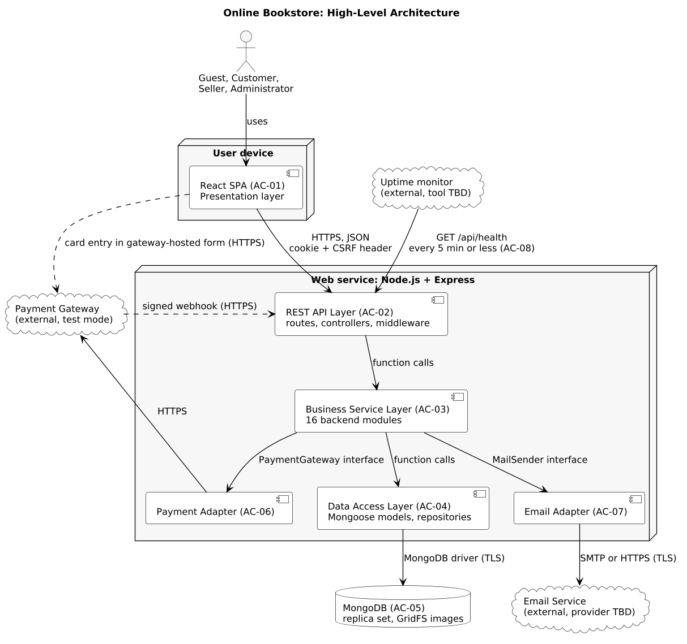
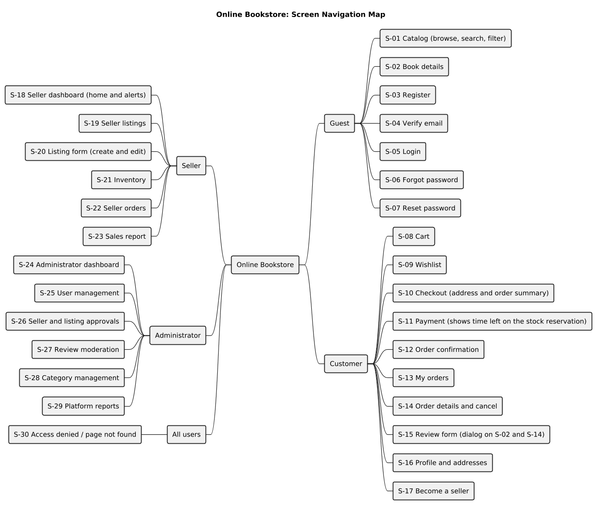

**ONLINE BOOKSTORE**

**An E-Commerce Platform for Buying and Selling Books Online**

**Phase 2: Design** 
High-Level Architecture Document

| | |
|---|---|
| **Members** | Anagha N (PES1UG24CS058) Manasvi B (PES1UG24CS261) Meda Sahasra Siri (PES1UG24CS267) Monika (PES1UG24CS274) |
| **Course** | Software Engineering |
| **Technology Stack** | MERN (MongoDB, Express.js, React, Node.js) |
| **Repository** | https://github.com/Ana-9211/Software-Engineering-Project- |
| **Based on** | Phase 1 Requirements (unchanged) |
| **Document Version** | 1.0 (Phase 2 draft for team review) |

# Contents

- [1. Introduction](#1-introduction)
    - [1.1 Purpose](#11-purpose)
    - [1.2 Relationship to Phase 1](#12-relationship-to-phase-1)
    - [1.3 Identifiers used in Phase 2](#13-identifiers-used-in-phase-2)
- [2. Architecture Overview](#2-architecture-overview)
    - [2.1 Architectural style and why it was chosen](#21-architectural-style-and-why-it-was-chosen)
    - [2.2 Layers and components](#22-layers-and-components)
    - [2.3 How data moves through the system](#23-how-data-moves-through-the-system)
    - [2.4 Technology summary](#24-technology-summary)
- [3. Architecture Diagram](#3-architecture-diagram)
    - [3.1 Boundaries and protocols](#31-boundaries-and-protocols)
- [4. Module and Component Decomposition](#4-module-and-component-decomposition)
    - [4.1 How the modules were derived](#41-how-the-modules-were-derived)
    - [4.2 Backend modules](#42-backend-modules)
    - [4.3 Frontend modules](#43-frontend-modules)
- [5. Interface Definition](#5-interface-definition)
- [6. UI/UX Architecture](#6-uiux-architecture)
    - [6.1 Navigation structure](#61-navigation-structure)
    - [6.2 Screens and their use cases](#62-screens-and-their-use-cases)
    - [6.3 Main flows](#63-main-flows)
    - [6.4 UI rules that come from the requirements](#64-ui-rules-that-come-from-the-requirements)
- [7. Deployment Architecture](#7-deployment-architecture)
    - [7.1 Deployment model](#71-deployment-model)
    - [7.2 Configuration and secrets](#72-configuration-and-secrets)
    - [7.3 Logging and monitoring](#73-logging-and-monitoring)
    - [7.4 Availability and keep-alive (VFR-09)](#74-availability-and-keep-alive-vfr-09)
    - [7.5 Scheduled work](#75-scheduled-work)
- [8. Security Architecture](#8-security-architecture)
    - [8.1 Security requirements mapped to the architecture](#81-security-requirements-mapped-to-the-architecture)
    - [8.2 Authentication and session flow](#82-authentication-and-session-flow)
    - [8.3 Role model](#83-role-model)
    - [8.4 Residual risks](#84-residual-risks)
- [9. Performance and Reliability Architecture](#9-performance-and-reliability-architecture)
    - [9.1 Design measures](#91-design-measures)
    - [9.2 Search design (FR-05, FR-06, VFR-02)](#92-search-design-fr-05-fr-06-vfr-02)
    - [9.3 Stock reservation and consistency (FR-30, FR-16, FR-09, VFR-14)](#93-stock-reservation-and-consistency-fr-30-fr-16-fr-09-vfr-14)
- [10. Traceability: Phase 1 to Architecture](#10-traceability-phase-1-to-architecture)
- [11. Design Decisions, Ambiguities and Open Items](#11-design-decisions-ambiguities-and-open-items)
    - [11.1 Design decisions and assumptions needing team approval](#111-design-decisions-and-assumptions-needing-team-approval)
    - [11.2 Ambiguities in Phase 1 (not changed)](#112-ambiguities-in-phase-1-not-changed)
    - [11.3 Items marked TBD](#113-items-marked-tbd)

# 1. Introduction

## 1.1 Purpose

This document defines the high-level architecture of the Online Bookstore: the major components, how they are decomposed into modules, how they communicate, how the screens are organised, how the system is deployed, and how security, performance and reliability requirements are built into the structure. It is a Phase 2 deliverable. The Software Design Document (`../design/Software-Design-Document.md`) goes deeper into classes, sequences, API, database and team allocation. The Validation Specification update (`../validation/Validation-Specification-Phase2-Update.md`) defines how this design will be validated.

## 1.2 Relationship to Phase 1

The Phase 1 Software Requirements Specification (`docs/phase-1/`) is the source of truth. This document does not change any requirement. It uses the Phase 1 identifiers exactly:

- 30 functional requirements FR-01 to FR-30
- 15 non-functional requirements (VFR) VFR-01 to VFR-15
- 25 use cases UC-01 to UC-25
- 6 actors: Guest, Customer, Seller, Administrator, Payment Gateway, Email Service

Where Phase 1 is silent or ambiguous, this document does not change Phase 1. It records the point as an ambiguity (A-nn) and states the design decision (D-nn) taken to proceed. Section 11 lists all of them for team approval.

## 1.3 Identifiers used in Phase 2

| Prefix | Meaning | Where defined |
|---|---|---|
| AC-nn | Architecture component | Section 2.2 |
| BM-nn | Backend module | Section 4.1 |
| FM-nn | Frontend module | Section 4.2 |
| I-nn | Internal or external interface | Section 5 |
| S-nn | Screen | Section 6 |
| API-nn | REST endpoint | Software Design Document, Section 6 |
| D-nn | Design decision | Section 11.1 |
| A-nn | Ambiguity in Phase 1 | Section 11.2 |

# 2. Architecture Overview

## 2.1 Architectural style and why it was chosen

The Online Bookstore is a **layered monolith with a single-page frontend**. A React single-page application (SPA) in the browser talks to one Node.js and Express REST API over HTTPS. The API is organised in layers (routes and controllers, business services, data access) and stores everything in one MongoDB database. Two external services, a Payment Gateway and an Email Service, are reached only through adapters.

| Reason | Explanation |
|---|---|
| Team size and schedule | Four students need one codebase they can all run locally. Microservices would add networking, deployment and debugging cost without any requirement that needs them (D-01). |
| Stack fixed by Phase 1 | MongoDB, Express, React and Node.js (MERN) are already decided. |
| Consistency needs | FR-30 (stock never negative), the reservation of stock before payment and VFR-14 (transactional order and payment writes) are easiest to guarantee when order, inventory and payment code run in one process with database transactions. |
| Availability on free hosting | VFR-09 needs a keep-alive mechanism. One web service means one process to keep alive and one health endpoint to monitor (D-02). |
| Security | One origin for the SPA and the API allows first-party HttpOnly cookies and simple CSRF protection (D-03). |
| Replaceable externals | Adapters keep the payment and email providers (still TBD) out of the business logic, so a provider can be chosen late or replaced by a fake in tests. |

## 2.2 Layers and components

| Layer | Component |
|---|---|
| Presentation | AC-01 React SPA |
| Backend API | AC-02 REST API Layer |
| Business logic | AC-03 Business Service Layer |
| Data access | AC-04 Data Access Layer |
| Database | AC-05 MongoDB Database |
| External integration | AC-06 Payment Adapter, AC-07 Email Adapter |
| Operations | AC-08 Health and Keep-Alive |

| ID | Component | Role |
|---|---|---|
| AC-01 | React SPA | Presentation layer. Single-page application that renders all screens, holds UI state and calls the REST API. |
| AC-02 | REST API Layer | Express routes, controllers and the middleware pipeline (security headers, CSRF, authentication, authorization, validation, rate limiting, error handling). |
| AC-03 | Business Service Layer | Domain services that implement the business rules and transactions. Controllers never touch the database directly. |
| AC-04 | Data Access Layer | Mongoose models and repositories. The only layer that talks to MongoDB. |
| AC-05 | MongoDB Database | Persistent store for all collections, including GridFS for book images. Runs as a replica set so multi-document transactions are available. |
| AC-06 | Payment Adapter | PaymentGateway interface and its provider implementation. Isolates the external Payment Gateway from the rest of the system. |
| AC-07 | Email Adapter | MailSender interface and its provider implementation. Isolates the external Email Service from the rest of the system. |
| AC-08 | Health and Keep-Alive | GET /api/health endpoint plus an external uptime monitor that calls it at intervals of 5 minutes or less. |

External parties (not components of the system): the **Payment Gateway** (Phase 1 actor A5), the **Email Service** (actor A6) and an **uptime monitor** (an operational tool, not a Phase 1 actor; tool TBD).

Rules that hold the layers apart:

1. The SPA only talks to the REST API (I-01). It never talks to MongoDB or to the email service.
2. Controllers validate and translate HTTP, then call services (I-02). They contain no business rules.
3. Services contain all business rules and transaction control. Only services call other services, repositories and adapters (I-03 to I-12).
4. Only repositories use Mongoose models, so a database change touches one layer.
5. Only the Payment module calls the Payment Adapter and only the Notification module calls the Email Adapter.

## 2.3 How data moves through the system

**Browsing (UC-01 to UC-03).** The browser loads the SPA files from the web service. The SPA calls `GET /api/books` with the search text and filters. The API layer validates the query, the Catalog service builds the database query, the repository reads approved books from MongoDB, and a page of 20 books returns as JSON. Book images are fetched from `GET /api/images/:imageId`, which streams them from MongoDB GridFS.

**Buying (UC-06, UC-08, UC-09).** The customer's cart is stored in MongoDB. At checkout the Order service reads the cart and, in one database transaction, **reserves** the stock of every line and saves the order with status PendingPayment, the prices and address copied into it, and a reservation expiry time (15 minutes by default). Reserving is a conditional update that succeeds only when enough units are available, where available means stock minus reserved. If any line cannot be reserved, nothing is reserved and the customer is told which book is short before any payment is started. The Payment module then creates a payment at the gateway. The browser pays directly in the gateway's hosted form, so card data never reaches this system. The SPA reports completion to `POST /api/orders/:orderId/payment/confirm`. The Order service verifies the payment with the gateway and then, in one transaction, **finalises** the reservation (stock is decremented and the reserved count reduced), marks the order Placed and clears the cart. After the commit the Notification module queues the confirmation email and the Email Adapter sends it. If the payment fails, the customer cancels, or the reservation expires, the reserved units are **released** and the order becomes PaymentFailed. The gateway also calls `POST /api/payments/webhook` with payment results; it follows the same idempotent code path as the confirm call.

**Fulfilling (UC-18).** The seller updates the status of the seller's own items. The Order service re-derives the order status so the customer sees it (UC-10).

**Moderating (UC-20 to UC-24).** The administrator's requests go through the Admin module, which calls the owning modules (User, Seller, Catalog, Review, Reporting).

**Monitoring (VFR-09).** The uptime monitor calls `GET /api/health` at intervals of 5 minutes or less. The call keeps the host awake and records availability.

## 2.4 Technology summary

| Area | Choice | Status |
|---|---|---|
| Frontend | React single-page application, React Router; build tool Vite | Stack fixed by Phase 1; Vite and Router proposed (D-15) |
| Backend | Node.js, Express REST API, JSON | Stack fixed by Phase 1 |
| Database | MongoDB with Mongoose, as a replica set (needed for transactions) | Stack fixed; hosting tier TBD |
| Payment | External Payment Gateway in test mode through the PaymentGateway interface | Provider TBD |
| Email | External Email Service through the MailSender interface | Provider TBD |
| Hosting | One web service serving API and SPA, plus managed MongoDB | Providers TBD |
| Testing | Jest, Supertest, Cypress or Playwright, k6, Lighthouse, OWASP ZAP | Candidates from Phase 1 |

# 3. Architecture Diagram

*Figure 1. High-level architecture. Solid arrows are calls made by the system. Dashed arrows are calls made by the browser directly to the gateway form, and the signed webhook from the gateway to the API.*

## 3.1 Boundaries and protocols

| From | To | Protocol | Notes | Interface |
|---|---|---|---|---|
| Browser (AC-01) | REST API (AC-02) | HTTPS, JSON | Cookie session and X-CSRF-Token header (VFR-05, VFR-06) | I-01 |
| Browser | Payment Gateway | HTTPS | Card entry in the gateway-hosted form only (VFR-08) | n/a (external) |
| Payment Gateway | REST API | HTTPS, JSON | Signed webhook to `/api/payments/webhook` | I-25 |
| Uptime monitor | REST API | HTTPS GET | `/api/health` every 5 minutes or less (VFR-09) | I-26 |
| REST API | Business Services | In-process calls | Same Node.js process | I-02 |
| Business Services | Data Access Layer | In-process calls | Repositories only | I-03 |
| Data Access Layer | MongoDB | MongoDB driver over TLS | Replica set; transactions | n/a |
| Payment module | Payment Adapter, Payment Gateway | HTTPS | create, verify, refund | I-11 |
| Notification module | Email Adapter, Email Service | SMTP over TLS or HTTPS | Provider TBD | I-12 |

Trust boundaries: the browser is untrusted (all input is validated again on the server); the web service and database form the trusted core; the Payment Gateway and Email Service are external, so their responses and callbacks are verified (signature check) or treated as best-effort (email).

# 4. Module and Component Decomposition

## 4.1 How the modules were derived

Backend modules were derived by grouping the 30 functional requirements by the data they own and the actor they serve. Rules used:

1. One module owns each important entity (users, books, cart, wishlist, orders, payments, reviews, seller applications, notifications, images).
2. Behaviour that two modules would otherwise duplicate becomes its own module. Stock changes are needed by cart (FR-09), order (FR-30), cancellation (FR-16) and seller (FR-21), so they live in one Inventory module. Email and alerts are needed by several modules, so they live in the Notification module. Reports (FR-23, FR-28) are read-only aggregations, so they live in the Reporting module. Seller listing management (create, edit, remove, approve) is kept apart from the read-only Catalog, in the Book Management module, so catalog reads stay simple and fast and the derived search fields are maintained in one place.
3. Cross-cutting security and infrastructure (VFR-05 to VFR-09, FR-29) form one Platform and Security module.
4. Frontend modules follow the use-case groups, so each screen belongs to one module.

Sixteen backend modules and eleven frontend modules result. Every FR is covered by at least one backend module, and every use case by at least one screen (Section 6).

## 4.2 Backend modules

#### BM-01 Authentication

| Item | Definition |
|---|---|
| Responsibility | Registration, email verification, login/logout, session token issue and validation, password reset, login lockout. |
| Inputs | Registration data, credentials, verification and reset tokens. |
| Outputs | Session cookie, current-user profile, verification and reset outcomes. |
| Depends on | BM-02 User and Profile, BM-13 Notification, BM-15 Platform and Security |
| Requirements | FR-01, FR-02, FR-03, FR-24, FR-29, VFR-04, VFR-07 |
| Use cases | UC-04, UC-05, UC-14 |

#### BM-02 User and Profile

| Item | Definition |
|---|---|
| Responsibility | User records, profile editing, saved addresses (maximum 5), account status and role changes requested by other modules. |
| Inputs | Profile and address data; status and role changes from Admin and Seller modules. |
| Outputs | Profile, address list, user pages for administrators. |
| Depends on | BM-15 Platform and Security |
| Requirements | FR-18, FR-24, FR-19 |
| Use cases | UC-13, UC-20, UC-21 |

#### BM-03 Catalog

| Item | Definition |
|---|---|
| Responsibility | Read-only catalog of approved books: pagination, indexed search (trigram index on title, author and ISBN), filters, sorting, book details, category list. Category create/rename/delete rules. Builds the derived search fields that Book Management stores. |
| Inputs | Query parameters (q, category, price range, rating, language, sort, page); category names. |
| Outputs | Book pages, book details, category list. |
| Depends on | BM-15 Platform and Security |
| Requirements | FR-04, FR-05, FR-06, FR-07, FR-26, VFR-01, VFR-02 |
| Use cases | UC-01, UC-02, UC-03, UC-23 |

#### BM-04 Cart

| Item | Definition |
|---|---|
| Responsibility | Persistent per-customer cart, quantities limited to available stock (stock minus reserved), price summary (subtotal, tax, shipping, total). |
| Inputs | Book id and quantity. |
| Outputs | Cart with current prices, availability and summary. |
| Depends on | BM-03 Catalog, BM-10 Inventory, BM-15 Platform and Security |
| Requirements | FR-08, FR-09, FR-12 |
| Use cases | UC-06, UC-08 |

#### BM-05 Wishlist

| Item | Definition |
|---|---|
| Responsibility | Per-customer wishlist of books. |
| Inputs | Book id. |
| Outputs | Wishlist with book summaries. |
| Depends on | BM-03 Catalog, BM-15 Platform and Security |
| Requirements | FR-10 |
| Use cases | UC-07 |

#### BM-06 Order

| Item | Definition |
|---|---|
| Responsibility | Checkout with stock reservation, order creation, payment confirmation that finalises the reservation, release of reservations (payment failure, cancellation, expiry), order history, status derivation, cancellation of placed orders. |
| Inputs | Address choice, payment confirmation data, order ids. |
| Outputs | Orders, payment session, order status. |
| Depends on | BM-02 User and Profile, BM-04 Cart, BM-07 Payment, BM-10 Inventory, BM-13 Notification, BM-15 Platform and Security |
| Requirements | FR-11, FR-12, FR-13, FR-14, FR-15, FR-16, FR-30, VFR-14 |
| Use cases | UC-08, UC-09, UC-10, UC-11 |

#### BM-07 Payment

| Item | Definition |
|---|---|
| Responsibility | Payment records and the only code that calls the Payment Gateway adapter: create payment, verify payment, verify webhook, refund. |
| Inputs | Order totals, gateway references, raw webhook body and signature. |
| Outputs | Payment session, verification result, refund result. |
| Depends on | AC-06 Payment Adapter, BM-15 Platform and Security |
| Requirements | FR-13, FR-16, VFR-08, VFR-14 |
| Use cases | UC-09, UC-11 |

#### BM-08 Review

| Item | Definition |
|---|---|
| Responsibility | Ratings and reviews with purchase-and-delivery eligibility, one review per customer per book, average rating maintenance. |
| Inputs | Rating, comment, book id. |
| Outputs | Review pages, updated book rating. |
| Depends on | BM-03 Catalog, BM-06 Order, BM-15 Platform and Security |
| Requirements | FR-17, FR-27 |
| Use cases | UC-12, UC-22 |

#### BM-09 Seller

| Item | Definition |
|---|---|
| Responsibility | Seller applications and their approval decisions, seller view of orders and item fulfilment updates. |
| Inputs | Application data, status updates, approval decisions. |
| Outputs | Applications, seller order views. |
| Depends on | BM-02 User and Profile, BM-06 Order, BM-15 Platform and Security |
| Requirements | FR-19, FR-22, FR-25 |
| Use cases | UC-15, UC-18, UC-21 |

#### BM-10 Inventory

| Item | Definition |
|---|---|
| Responsibility | All stock changes. Available units = stock minus reserved. Atomic reservation at checkout, finalisation at payment confirmation (stock decremented), release when payment fails, is abandoned or expires, restore on cancellation of a placed order, seller stock updates, out-of-stock and low-stock detection. |
| Inputs | Book ids with quantities, optional database session. |
| Outputs | Success or insufficient-stock result, low-stock events. |
| Depends on | BM-13 Notification, BM-15 Platform and Security |
| Requirements | FR-09, FR-16, FR-21, FR-30, VFR-14 |
| Use cases | UC-06, UC-08, UC-11, UC-17 |

#### BM-11 Admin

| Item | Definition |
|---|---|
| Responsibility | Administrator-facing operations: user suspension and reactivation, approval queues, category management, review moderation. Delegates to the owning modules. |
| Inputs | Administrator requests and decisions. |
| Outputs | Lists, updated records. |
| Depends on | BM-01 Authentication, BM-02 User and Profile, BM-03 Catalog, BM-08 Review, BM-09 Seller, BM-12 Reporting, BM-15 Platform and Security, BM-16 Book Management |
| Requirements | FR-19, FR-24, FR-25, FR-26, FR-27, FR-28 |
| Use cases | UC-20, UC-21, UC-22, UC-23, UC-24 |

#### BM-12 Reporting

| Item | Definition |
|---|---|
| Responsibility | Read-only aggregations: seller sales report and administrator platform report. |
| Inputs | Date range, seller id. |
| Outputs | Sales report, platform report. |
| Depends on | BM-06 Order, BM-15 Platform and Security |
| Requirements | FR-23, FR-28 |
| Use cases | UC-19, UC-24 |

#### BM-13 Notification

| Item | Definition |
|---|---|
| Responsibility | Email notifications (verification, password reset, order confirmation) with retry, and in-app low-stock alerts for sellers. Only module that calls the Email adapter. |
| Inputs | Notification type, recipient, template data. |
| Outputs | Notification records, sent emails, in-app alert lists. |
| Depends on | AC-07 Email Adapter, BM-15 Platform and Security |
| Requirements | FR-01, FR-03, FR-14, FR-21 |
| Use cases | UC-25, UC-17 |

#### BM-14 Media

| Item | Definition |
|---|---|
| Responsibility | Book image upload (JPEG or PNG, up to 2 MB, up to 3 per listing) and image delivery from MongoDB GridFS. |
| Inputs | Multipart image file, image id. |
| Outputs | Image id and URL, image bytes. |
| Depends on | BM-15 Platform and Security |
| Requirements | FR-07, FR-20 |
| Use cases | UC-03, UC-16 |

#### BM-15 Platform and Security

| Item | Definition |
|---|---|
| Responsibility | Cross-cutting infrastructure: configuration, security headers, CSRF protection, authentication guard, role guard, input validation, NoSQL-injection sanitizing, rate limiting, error handling, request logging with redaction, health endpoint, OpenAPI document. |
| Inputs | Every HTTP request. |
| Outputs | Authenticated request context or a uniform error response. |
| Depends on | None |
| Requirements | FR-29, VFR-05, VFR-06, VFR-07, VFR-08, VFR-09, VFR-13, VFR-15 |
| Use cases | All (UC-01 to UC-25) |

#### BM-16 Book Management

| Item | Definition |
|---|---|
| Responsibility | Seller book listings: create, edit, remove, own listing list, administrator approval decisions for listings, and maintenance of the derived search fields. Kept apart from the read-only Catalog so catalog reads stay simple and fast. |
| Inputs | Listing data, image ids, approval decisions. |
| Outputs | Listings with status. |
| Depends on | BM-03 Catalog, BM-10 Inventory, BM-14 Media, BM-15 Platform and Security |
| Requirements | FR-20, FR-25 |
| Use cases | UC-16, UC-21 |

## 4.3 Frontend modules

#### FM-01 Authentication UI

| Item | Definition |
|---|---|
| Responsibility | Account creation, email verification, login and password reset forms. |
| Main components | RegisterPage, VerifyEmailPage, LoginPage, ForgotPasswordPage, ResetPasswordPage |
| Calls | API-01, API-02, API-03, API-04, API-05, API-06, API-07, API-08, API-09 |
| Requirements | FR-01, FR-02, FR-03 |
| Use cases | UC-04, UC-05, UC-14 |

#### FM-02 Catalog UI

| Item | Definition |
|---|---|
| Responsibility | Browse, search, filter and sort the catalog; show book details with rating and stock status. |
| Main components | CatalogPage, SearchBar, FilterPanel, SortSelect, BookCard, Pagination, BookDetailPage, AddToCartButton, WishlistButton |
| Calls | API-15, API-16, API-17, API-18, API-19, API-21, API-25 |
| Requirements | FR-04, FR-05, FR-06, FR-07 |
| Use cases | UC-01, UC-02, UC-03 |

#### FM-03 Cart UI

| Item | Definition |
|---|---|
| Responsibility | View and edit the cart; show stock errors and the price summary. |
| Main components | CartPage, CartItemRow, OrderSummaryBox |
| Calls | API-20, API-21, API-22, API-23 |
| Requirements | FR-08, FR-09, FR-12 |
| Use cases | UC-06 |

#### FM-04 Wishlist UI

| Item | Definition |
|---|---|
| Responsibility | Add, view and remove wishlist books. |
| Main components | WishlistPage, WishlistButton, MoveToCartButton |
| Calls | API-21, API-24, API-25, API-26 |
| Requirements | FR-10 |
| Use cases | UC-07 |

#### FM-05 Checkout and Payment UI

| Item | Definition |
|---|---|
| Responsibility | Select or enter a shipping address, show the order summary, hand the customer to the gateway payment form, show the outcome. |
| Main components | CheckoutPage, AddressSelector, AddressForm, PaymentPage, OrderConfirmationPage |
| Calls | API-10, API-12, API-20, API-27, API-28, API-31 |
| Requirements | FR-11, FR-12, FR-13, FR-14 |
| Use cases | UC-08, UC-09 |

#### FM-06 Orders UI

| Item | Definition |
|---|---|
| Responsibility | Order history, status tracking and cancellation. |
| Main components | OrderListPage, OrderDetailPage, CancelOrderDialog, StatusBadge |
| Calls | API-30, API-31, API-32 |
| Requirements | FR-15, FR-16 |
| Use cases | UC-10, UC-11 |

#### FM-07 Reviews UI

| Item | Definition |
|---|---|
| Responsibility | Submit ratings and reviews; display reviews on the book page. |
| Main components | ReviewForm, ReviewList, StarRating |
| Calls | API-17, API-33 |
| Requirements | FR-17 |
| Use cases | UC-12 |

#### FM-08 Profile and Seller Application UI

| Item | Definition |
|---|---|
| Responsibility | Edit profile, manage up to 5 addresses, apply to become a seller and see the decision. |
| Main components | ProfilePage, AddressBook, SellerApplicationPage |
| Calls | API-10, API-11, API-12, API-13, API-14, API-34, API-35 |
| Requirements | FR-18, FR-19 |
| Use cases | UC-13, UC-15 |

#### FM-09 Seller Dashboard UI

| Item | Definition |
|---|---|
| Responsibility | Listings, inventory, low-stock alerts, order fulfilment and sales report for sellers. |
| Main components | SellerHome, ListingsPage, ListingForm, ImageUploader, InventoryPage, SellerOrdersPage, SalesReportPage, AlertList |
| Calls | API-36, API-37, API-38, API-39, API-40, API-41, API-42, API-43, API-44, API-45, API-46, API-18, API-19 |
| Requirements | FR-20, FR-21, FR-22, FR-23 |
| Use cases | UC-16, UC-17, UC-18, UC-19 |

#### FM-10 Administrator Dashboard UI

| Item | Definition |
|---|---|
| Responsibility | User management, seller and listing approvals, review moderation, categories and platform reports. |
| Main components | AdminHome, UsersPage, ApprovalsPage, ReviewModerationPage, CategoriesPage, PlatformReportPage |
| Calls | API-47, API-48, API-49, API-50, API-51, API-52, API-53, API-54, API-55, API-56, API-57, API-58, API-59, API-60, API-18 |
| Requirements | FR-24, FR-25, FR-26, FR-27, FR-28 |
| Use cases | UC-20, UC-21, UC-22, UC-23, UC-24 |

#### FM-11 Shared UI Infrastructure

| Item | Definition |
|---|---|
| Responsibility | Layout, role-aware navigation, route guards, API client (credentials and CSRF header), authentication state, error display. |
| Main components | AppShell, NavBar (role-aware), ProtectedRoute, RoleRoute, ApiClient, AuthContext, ErrorBoundary, Toast, form components |
| Calls | API-01, API-07 |
| Requirements | FR-29 |
| Use cases | UC-05 |

# 5. Interface Definition

The table lists the major interfaces. Interfaces I-01 to I-03 are general conventions; I-04 to I-24 and I-28 are calls between modules (I-11 and I-12 are the calls to the external adapters); I-25 and I-26 are inbound calls from external parties; I-27 is the internal reservation timer. REST endpoint details are in the Software Design Document, Section 6.

| ID | Caller | Provider | Purpose | Input | Output | Error behaviour | Requirements and use cases |
|---|---|---|---|---|---|---|---|
| I-01 | React SPA (ApiClient) | REST API Layer | All client-server communication (JSON over HTTPS, cookie session, CSRF header). | HTTP request: method, path, JSON body or query, cookie, X-CSRF-Token. | JSON body with documented status code, or uniform error object. | Uniform error object { error: { code, message, details } } with the status codes of Section 5. | All FR; UC-01 to UC-25 |
| I-02 | Controller | Service | Controller passes validated, typed input to a service and maps the result to an HTTP response. | DTO (validated body, query, params) and authenticated user context { userId, roles }. | Plain result object or thrown AppError. | Services throw AppError(code, status, message); the error handler converts it to the uniform error object. | All FR |
| I-03 | Service | Repository | All database access. Services never use Mongoose models directly. | Query or entity data; optional MongoDB session for transactions. | Entity objects or null. | Database errors are wrapped as AppError(INTERNAL_ERROR); duplicate-key errors are mapped by the repository to CONFLICT codes. | All FR; VFR-14 |
| I-04 | AuthService | NotificationService | sendVerificationEmail(user, token) and sendPasswordResetEmail(user, token). | User (id, name, email) and the raw one-time token. | Resolves when the notification is queued. | Never throws to the caller; failures are recorded on the notification and retried. | FR-01, FR-03; UC-04, UC-14, UC-25 |
| I-05 | AuthService | UserService | Create users, look up by email, record login failures and lock state, set password hash, change token version. | Email, user data or user id. | User entity or null. | EMAIL_TAKEN on duplicate email. | FR-01, FR-02, FR-03; VFR-04, VFR-07 |
| I-06 | CartService | InventoryService | checkAvailability(items) before any cart quantity is accepted. Available units are stock minus reserved. | List of { bookId, quantity }. | { ok } or the first failing book with available units. | INSUFFICIENT_STOCK with available quantity; NOT_FOUND for unknown or hidden book. | FR-09; UC-06 |
| I-07 | OrderService | CartService | getValidatedCart(userId), computeSummary(items), clear(userId, session). | User id; optional session. | Cart lines with current prices and summary; empty confirmation. | VALIDATION_ERROR when the cart is empty; INSUFFICIENT_STOCK when a line is no longer available. | FR-11, FR-12; UC-08 |
| I-08 | OrderService | PaymentService | createPaymentSession(order), verifyPayment(order, paymentRef), refund(payment, amount). | Order totals and references. | Payment session; verification result; refund result. | PAYMENT_GATEWAY_ERROR on gateway failure; PAYMENT_VERIFICATION_FAILED when the gateway does not confirm. | FR-13, FR-16; UC-08, UC-09, UC-11 |
| I-09 | OrderService | InventoryService | reserve(items, session) at checkout; finalizeReservation(items, session) at payment confirmation; releaseReservation(items, session) on payment failure, abandonment or expiry; restore(items, session) when a placed order is cancelled. | Items { bookId, quantity }; the open transaction session. | Success, or failure with the first book that has too few available units. | INSUFFICIENT_STOCK aborts the surrounding transaction, so nothing stays reserved. | FR-30, FR-16, FR-09; UC-08, UC-11 |
| I-10 | OrderService | NotificationService | sendOrderConfirmation(order, user), called only after the transaction commits. | Confirmed order and user. | Resolves when queued. | Never fails the order; failures recorded and retried. | FR-14; UC-08, UC-25 |
| I-11 | PaymentService | PaymentGateway adapter | createPayment, verifyPayment, verifyWebhook, refund against the external Payment Gateway. | Amount in minor units, currency, order reference; gateway ids and signature. | Gateway ids, status, verification boolean, refund id. | GatewayError (timeout, 4xx, 5xx) mapped by PaymentService to PAYMENT_GATEWAY_ERROR; no card data ever passes this interface. | FR-13, FR-16; VFR-08 |
| I-12 | NotificationService | MailSender adapter | send(message) to the external Email Service. | { to, subject, text, html }. | { providerMessageId } or error. | MailError recorded; NotificationService retries up to 3 times with backoff. | FR-01, FR-03, FR-14; UC-25 |
| I-13 | InventoryService | NotificationService | notifyLowStock(book) when stock falls to or below the threshold. | Book with sellerId, title, stock, threshold. | In-app notification created once per crossing of the threshold. | Never throws to the caller. | FR-21; UC-17 |
| I-14 | ReviewService | OrderService / OrderRepository | hasDeliveredItem(userId, bookId) to check eligibility. | User id, book id. | Boolean. | NOT_ELIGIBLE (403) when false. | FR-17; UC-12 |
| I-15 | ReviewService | CatalogService | recalculateRating(bookId, session) after a review is added or removed. | Book id; optional session. | Updated avgRating and reviewCount. | NOT_FOUND. | FR-17, FR-27, FR-07 |
| I-16 | BookManagementService | MediaService | assertImagesOwned(sellerId, imageIds) when a listing is saved. | Seller id, image ids. | Resolves or throws. | VALIDATION_ERROR when an image is unknown or belongs to another seller. | FR-20; UC-16 |
| I-17 | BookManagementService | InventoryService | setStock(sellerId, bookId, stock, threshold) with owner filter, for the seller inventory screen. | Seller id, book id, numbers. | Updated book. | NOT_FOUND when the book is not owned by the seller; STOCK_BELOW_RESERVED. | FR-20, FR-21; UC-16, UC-17 |
| I-18 | FulfilmentService | OrderService | applyItemStatus(orderId, itemId, sellerId, status), which re-derives the order status. | Ids and next status. | Updated order. | NOT_FOUND; INVALID_STATUS_TRANSITION. | FR-22, FR-15; UC-18 |
| I-19 | SellerService | UserService | grantRole(userId, "seller", sellerProfile) when an application is approved. | User id, profile. | Updated user. | NOT_FOUND. | FR-19; UC-21 |
| I-20 | AdminService | SellerService / BookManagementService | decideApplication (SellerService) and decideListing (BookManagementService): approve or reject with reason. | Admin id, record id, decision, reason. | Updated record. | NOT_FOUND; NOT_PENDING. | FR-25; UC-21 |
| I-21 | AdminService | UserService / AuthService | setStatus(userId, status) then invalidateSessions(userId) on suspension. | Admin id, user id, status. | Updated user. | NOT_FOUND; CANNOT_MODIFY_SELF. | FR-24; UC-20 |
| I-22 | AdminService | CatalogService / ReviewService / ReportingService | Category operations, review deletion, platform report. | Names, ids, date range. | Updated records or report. | CATEGORY_EXISTS, CATEGORY_IN_USE, NOT_FOUND, INVALID_DATE_RANGE. | FR-26, FR-27, FR-28; UC-22, UC-23, UC-24 |
| I-23 | ReportingService | OrderRepository | Aggregation queries for sales and platform reports. | Seller id (optional), date range. | Aggregated rows. | INVALID_DATE_RANGE validated before the query. | FR-23, FR-28; UC-19, UC-24 |
| I-24 | authGuard (Platform) | UserService | Load the user named in the token and check status and token version on every protected request. | userId and tokenVersion from the verified token. | User context or rejection. | UNAUTHENTICATED (401) when token invalid, expired or version mismatch; ACCOUNT_SUSPENDED (403). | FR-02, FR-24, FR-29 |
| I-25 | Payment Gateway (external) | PaymentController | Server-to-server event callback (webhook). | Raw JSON body and signature header. | 200 { received: true }. | 401 INVALID_SIGNATURE when the signature check fails; the event is ignored. | FR-13; UC-09 |
| I-26 | Uptime monitor (external) | HealthController | GET /api/health every 5 minutes or less. | None. | 200 { status: ok, db: up } or 503. | 503 when the database check fails. | VFR-09 |
| I-27 | ReservationSweeper (Order module timer) | OrderService | releaseExpiredReservations() every minute and once at start-up: closes unpaid orders whose reservation has expired and releases their units. | None (timer). | Number of reservations released. | Each order is released in its own transaction; a failure is logged and retried at the next run; running twice is harmless. | FR-30, VFR-14, VFR-09 |
| I-28 | BookManagementService | CatalogService | buildSearchFields(title, author, isbn) whenever a listing is created or its title, author or ISBN changes. | Title, author, ISBN. | { titleLower, authorLower, searchText, searchTrigrams }. | VALIDATION_ERROR for empty values. | FR-05, FR-20; UC-02, UC-16 |

**Common error behaviour.** Every error that leaves the REST API has the same shape: `{ "error": { "code": "...", "message": "...", "details": [ ... ] } }` with the HTTP status codes listed in the Software Design Document, Section 6. Services signal errors by throwing an `AppError` carrying a code and a status. Adapters signal failures with their own error types, which the calling service converts to an `AppError`.

# 6. UI/UX Architecture

## 6.1 Navigation structure

The navigation depends on who is logged in. The SPA reads the current user from `GET /api/auth/me` and shows only the menu entries that user may use. Route guards hide screens the user may not open and the API enforces the same rules (FR-29).

| Visitor state | Menu entries |
|---|---|
| Guest (not logged in) | Catalog, Search, Log in, Register |
| Customer | Catalog, Wishlist, Cart, My orders, Profile, Become a seller (until approved), Log out |
| Seller (also a Customer, D-04) | All Customer entries plus Seller dashboard (Listings, Inventory, Seller orders, Sales report) |
| Administrator | Admin dashboard (Users, Approvals, Reviews, Categories, Reports), Log out |

*Figure 2. Screen navigation map grouped by who can open each screen.*

## 6.2 Screens and their use cases

Every use case from UC-01 to UC-25 is realised by at least one screen or, for UC-25 and the include parts of UC-04 and UC-14, by an email. UC-09 and UC-25 are not separate screens: UC-09 is the gateway payment step (S-11) and UC-25 is the email sent by the system.

| ID | Screen | Route | Who can open it | Use cases | Module | API calls |
|---|---|---|---|---|---|---|
| S-01 | Catalog (browse, search, filter) | `/books` | Guest, Customer | UC-01, UC-02 | FM-02 | API-15, API-18 |
| S-02 | Book details | `/books/:bookId` | Guest, Customer | UC-03 | FM-02 | API-16, API-17, API-19, API-21, API-25 |
| S-03 | Register | `/register` | Guest | UC-04 | FM-01 | API-01, API-02 |
| S-04 | Verify email | `/verify-email?token=` | Guest | UC-04 | FM-01 | API-03, API-04 |
| S-05 | Login | `/login` | Guest (becomes Customer, Seller or Administrator on login) | UC-05 | FM-01 | API-01, API-05, API-07 |
| S-06 | Forgot password | `/forgot-password` | Guest | UC-14 | FM-01 | API-01, API-08 |
| S-07 | Reset password | `/reset-password?token=` | Guest | UC-14 | FM-01 | API-01, API-09 |
| S-08 | Cart | `/cart` | Customer | UC-06 | FM-03 | API-20, API-22, API-23 |
| S-09 | Wishlist | `/wishlist` | Customer | UC-07 | FM-04 | API-21, API-24, API-25, API-26 |
| S-10 | Checkout (address and order summary) | `/checkout` | Customer | UC-08 | FM-05 | API-10, API-12, API-20, API-27 |
| S-11 | Payment (shows time left on the stock reservation) | `/checkout/:orderId/pay` | Customer | UC-09 | FM-05 | API-28 |
| S-12 | Order confirmation | `/orders/:orderId/confirmation` | Customer | UC-08 | FM-05 | API-31 |
| S-13 | My orders | `/orders` | Customer | UC-10 | FM-06 | API-30 |
| S-14 | Order details and cancel | `/orders/:orderId` | Customer | UC-10, UC-11 | FM-06 | API-31, API-32 |
| S-15 | Review form (dialog on S-02 and S-14) | `(dialog)` | Customer | UC-12 | FM-07 | API-17, API-33 |
| S-16 | Profile and addresses | `/profile` | Customer | UC-13 | FM-08 | API-10, API-11, API-12, API-13, API-14 |
| S-17 | Become a seller | `/seller/apply` | Customer | UC-15 | FM-08 | API-34, API-35 |
| S-18 | Seller dashboard (home and alerts) | `/seller` | Seller | UC-16, UC-17, UC-18, UC-19 | FM-09 | API-45, API-46 |
| S-19 | Seller listings | `/seller/books` | Seller | UC-16 | FM-09 | API-36, API-39 |
| S-20 | Listing form (create and edit) | `/seller/books/new and /seller/books/:bookId/edit` | Seller | UC-16 | FM-09 | API-18, API-19, API-37, API-38, API-41 |
| S-21 | Inventory | `/seller/inventory` | Seller | UC-17 | FM-09 | API-36, API-40 |
| S-22 | Seller orders | `/seller/orders` | Seller | UC-18 | FM-09 | API-42, API-43 |
| S-23 | Sales report | `/seller/reports` | Seller | UC-19 | FM-09 | API-44 |
| S-24 | Administrator dashboard | `/admin` | Administrator | UC-20, UC-21, UC-22, UC-23, UC-24 | FM-10 | API-49, API-52 |
| S-25 | User management | `/admin/users` | Administrator | UC-20 | FM-10 | API-47, API-48 |
| S-26 | Seller and listing approvals | `/admin/approvals` | Administrator | UC-21 | FM-10 | API-49, API-50, API-51, API-52, API-53, API-54 |
| S-27 | Review moderation | `/admin/reviews` | Administrator | UC-22 | FM-10 | API-58, API-59 |
| S-28 | Category management | `/admin/categories` | Administrator | UC-23 | FM-10 | API-18, API-55, API-56, API-57 |
| S-29 | Platform reports | `/admin/reports` | Administrator | UC-24 | FM-10 | API-60 |
| S-30 | Access denied / page not found | `(any unauthorised or unknown route)` | All | UC-05 | FM-11 | API-07 |

## 6.3 Main flows

**Purchase flow (UC-02, UC-03, UC-06, UC-08, UC-09).** S-01 Catalog (search and filter) leads to S-02 Book details (Add to cart), then S-08 Cart, S-10 Checkout (choose or enter address, see the order summary), S-11 Payment and S-12 Order confirmation. The shortest path from a book page to the confirmation is: add to cart (1), go to checkout (2), choose address (3), pay (4), see confirmation (5), which is within the 6-step limit of VFR-10 (A-06 states how steps are counted).

**Seller flow (UC-15, UC-16, UC-17, UC-18, UC-19).** A Customer applies on S-17. After the administrator approves (S-26), the Seller dashboard (S-18) appears in the menu. Listings are created on S-20 and appear in the catalog only after approval. Stock is changed on S-21, orders are processed on S-22 and the report is on S-23.

**Administrator flow (UC-20 to UC-24).** The dashboard (S-24) shows queues with pending counts that open S-26. Other screens are S-25 users, S-27 reviews, S-28 categories and S-29 reports.

## 6.4 UI rules that come from the requirements

| Requirement | UI rule |
|---|---|
| VFR-10 responsive 360 px to 1920 px | Mobile-first layout with three breakpoints: 360, 768 and 1280 px; no horizontal scrolling at 360 px; touch targets of at least 44 px |
| VFR-11 accessibility score 90 or higher | Semantic HTML, labelled form fields, visible focus, sufficient colour contrast, alternative text for book covers, keyboard operation of all controls |
| VFR-12 browser support | No experimental browser features; build targets set to the latest 2 versions of Chrome, Firefox, Edge and Safari |
| VFR-06 XSS | React renders all user-supplied text as text; `dangerouslySetInnerHTML` is not used and is banned by a lint rule |
| FR-09 stock message | The cart and book pages show the API message when quantity exceeds stock |
| FR-12 summary | Subtotal, tax, shipping and total are shown on the cart and checkout screens in the format returned by the API (minor units converted to 2 decimals for display only) |
| General | Every screen has a loading state, an empty state and an error state; form validation in the browser repeats the server rules for fast feedback but never replaces them |

# 7. Deployment Architecture

*Figure 3. Deployment diagram. Providers marked TBD are not yet selected.*

## 7.1 Deployment model

The course deployment is one **web service** running the Node.js and Express application. The service exposes the REST API under `/api` and also serves the compiled React files, so the browser sees one origin (D-02). MongoDB runs as a managed replica set. No hosting provider has been selected yet; the intended model below is independent of the provider.

| Item | Intended model | Status |
|---|---|---|
| Frontend hosting | Static files of the React build, served by the same web service | Provider TBD |
| Backend hosting | One Node.js web service (free or low tier) | Provider TBD |
| Database | Managed MongoDB replica set with daily backup (VFR-14); also stores book images (GridFS) | Provider and tier TBD |
| Image storage | Book images are stored in the same MongoDB database with GridFS; no separate storage service (justification in the Software Design Document, Section 8.6) | No extra provider; the database tier needs room for images (Section 11.3) |
| HTTPS | TLS terminated by the hosting platform; HTTP redirected to HTTPS; HSTS header (VFR-05) | Depends on provider; must support TLS 1.2 or higher |
| Environments | Local development (MongoDB as a single-node replica set, fake gateway, console mailer); one deployed environment used for staging, validation and the final demo | Planned |
| External services | Payment Gateway in test mode; Email Service | Providers TBD |
| Uptime monitor | External tool calling `/api/health` every 5 minutes or less | Tool TBD |

## 7.2 Configuration and secrets

All configuration comes from environment variables. Secrets are never committed to the repository. A `.env.example` file lists names without values.

| Variable | Purpose |
|---|---|
| NODE_ENV | development, test or production |
| PORT | Port the service listens on |
| MONGODB_URI | Connection string including replica set options |
| JWT_SECRET | Key used to sign session tokens |
| CSRF_SECRET | Key used for CSRF tokens |
| BCRYPT_COST | Password hashing cost, default 12, never below 10 (VFR-04) |
| PAYMENT_PROVIDER, PAYMENT_KEY_ID, PAYMENT_KEY_SECRET, PAYMENT_WEBHOOK_SECRET | Gateway selection and credentials |
| MAIL_PROVIDER, MAIL_HOST, MAIL_USER, MAIL_PASSWORD, MAIL_FROM | Email Service settings |
| CURRENCY, TAX_RATE_PERCENT, SHIPPING_FLAT_FEE | Pricing configuration (values TBD, A-03) |
| APP_BASE_URL | Used to build links in emails |
| RATE_LIMIT_GLOBAL, RATE_LIMIT_AUTH | Rate limits; raised only for load tests |
| RESERVATION_MINUTES | How long stock stays reserved for an unpaid checkout (default 15) |

## 7.3 Logging and monitoring

| Aspect | Design |
|---|---|
| Request log | One line per request: time, method, path, status, duration, user id (never cookies, tokens, passwords or card data) |
| Application log | Structured JSON lines to standard output; the host collects them |
| Redaction | A redaction function removes fields named password, token, authorization, cookie, card and secret before logging (VFR-08) |
| Audit entries | Login failures, lockouts, role changes, suspensions, approvals and refunds are logged with the acting user id |
| Health | `GET /api/health` returns 200 with `db: up` or 503 with `db: down` |

## 7.4 Availability and keep-alive (VFR-09)

Free and low-tier hosts put idle services to sleep. To meet VFR-09:

1. An external uptime monitor sends `GET /api/health` every 5 minutes or less during the evaluation window. This is the keep-alive mechanism: the regular request prevents the service from idling.
2. The same checks provide the availability measurement: availability is successful checks divided by total checks, and must be at least 99%.
3. The health endpoint checks the database connection, so a service that is up but cut off from its database is counted as unavailable.
4. The evaluation window dates and the monitor tool are TBD (A-09).

## 7.5 Scheduled work

One background task runs inside the web service: the reservation sweeper (BM-06, interface I-27). It runs at start-up and then every minute, and closes unpaid orders whose reservation has expired, releasing their units. It needs no separate worker or scheduler service. It depends on the service being awake, which the keep-alive of Section 7.4 provides; if the service did sleep, reservations would simply be released at the next start-up.

# 8. Security Architecture

## 8.1 Security requirements mapped to the architecture

| Concern | Requirement | Mechanism in the architecture | Where |
|---|---|---|---|
| Password storage | VFR-04 | Passwords hashed with bcrypt (cost 12 by default, never below 10), salted per hash. Only `passwordHash` is stored. It is never returned by the API or logged | BM-01 PasswordService, BM-02 |
| Authentication | FR-02 | Email and password login. A signed token with a 60-minute expiry and the user's token version is placed in an HttpOnly, Secure, SameSite=Lax cookie | BM-01 TokenService, BM-15 authGuard |
| Session handling | FR-02, FR-24 | On every protected request, `authGuard` verifies the token and loads the user to check status and token version. Logout, password reset and suspension increase the token version, which invalidates existing tokens. No refresh token is used (D-03, D-14) | BM-15, BM-01 |
| Authorization (RBAC) | FR-29 | `requireRole` on every route (matrix in Software Design Document Section 6.6). Resource ownership is checked in services using the user id from the token, never from request parameters. Other users' resources return 404 | BM-15 and all service modules |
| Account lockout | VFR-07 | `failedLoginCount` and `lockUntil` on the user. After 5 consecutive failures the account is locked for 15 minutes and login returns 423. A success resets the counter | BM-01 |
| Input validation | VFR-06 | Every route has a schema for body, query and params. Unknown fields are rejected or stripped. Types are enforced before they reach a query | BM-15 validate |
| Injection | VFR-06 | Schema-typed Mongoose models; request objects containing keys that start with `$` or contain `.` are rejected; search text is escaped before it is used in a pattern; no query is built by string concatenation | BM-15 sanitize, BM-03 |
| XSS | VFR-06 | React escapes output; no raw HTML rendering; Content-Security-Policy header limits scripts and frames; user text stays plain text | AC-01, BM-15 helmetConfig |
| CSRF | VFR-06 | Double-submit token: the SPA reads a token from `GET /api/auth/csrf-token` and sends it in `X-CSRF-Token` on every state-changing request; the server compares it with the CSRF cookie. Cookies are SameSite=Lax | BM-15 csrfProtection |
| Transport security | VFR-05 | HTTPS only; HTTP redirected; HSTS; Secure cookies; outbound calls to gateway, email and database use TLS | Hosting platform, BM-15 |
| Payment data | VFR-08 | Card details are entered in the gateway-hosted form and never sent to this system. The system stores gateway references and amounts only. Webhooks are authenticated by signature. The logging redaction function removes card-like fields | BM-07, AC-06, BM-15 requestLogger |
| Secrets | VFR-04, VFR-08 | Environment variables only; `.env` ignored by git; secret scanning before release | Deployment (Section 7.2) |
| API abuse | VFR-06 | Rate limits (stricter on authentication endpoints), request body size limit, upload size and type limits | BM-15 rateLimiter, BM-14 |
| Stock hoarding by abandoned checkouts | FR-30, VFR-06 | Reservations expire (15 minutes by default); a new checkout releases the customer's earlier unpaid order; checkout is rate limited | BM-06, BM-10, BM-15 |
| Audit and logging | FR-24, FR-25 | Security-relevant events are logged with actor id and time, without secrets | BM-15 requestLogger |

## 8.2 Authentication and session flow

1. The SPA calls `GET /api/auth/csrf-token`. The API returns a token and sets the CSRF cookie.
2. The user logs in with `POST /api/auth/login` (CSRF token required). On success the API sets the session cookie.
3. The browser sends the cookie automatically on later requests. The SPA adds the CSRF header to every request that changes data.
4. `authGuard` runs before each protected route: verify signature and expiry, load the user, reject if suspended or if the token version differs.
5. `requireRole` then checks the role. Services check ownership.
6. Logout clears the cookie and increases the token version.

## 8.3 Role model

A user has a list of roles. A new account has `customer`. Approval of a seller application adds `seller`, so a seller keeps customer abilities (D-04, A-01). An administrator has only `admin`; administrator accounts are created by a seed script because Phase 1 has no use case for creating them. The same user can therefore be Customer and Seller, and FR-29 is satisfied because every endpoint lists the roles allowed to use it.

## 8.4 Residual risks

| Risk | Note |
|---|---|
| Logout affects all of a user's sessions | Consequence of the token-version approach (D-14); acceptable for this project |
| Registration reveals that an email exists (409) | Required by FR-01 uniqueness; login, password reset and resend return the same message for known and unknown emails |
| Refund can fail after cancellation | The order is cancelled and the payment is marked refund_pending; no retry screen is in scope (A-05) |

# 9. Performance and Reliability Architecture

The numbers below are design targets and test conditions taken from Phase 1. No measurement has been made yet.

## 9.1 Design measures

| Requirement | Design measure |
|---|---|
| VFR-01 page load 3 s or less (p95) at 100 users | SPA split by route so the first page loads only what it needs; compressed responses (gzip); long-lived caching of hashed static files; book images served with cache headers; pagination of 20 books per page; no blocking calls on page load other than the data the page shows |
| VFR-02 search and browse API 500 ms or less (p95) | Search runs on indexes only (Section 9.2); filters and sorts use compound indexes that start with `status`; queries return only the fields the list needs; fixed page size of 20; one page query and one count query; connection pooling in the MongoDB driver |
| VFR-03 100 concurrent users, error rate below 1% | Stateless API process; connection pool sized above expected concurrency; per-request timeouts; rate limits that do not throttle normal users (and are configurable for load tests) |
| FR-30 stock never negative | Stock is reserved at checkout, finalised at payment confirmation and released on failure, cancellation or expiry, each by a conditional update on one book document (Section 9.3) |
| VFR-14 transactional order and payment | Reservation, finalisation, cancellation and review changes each run in one MongoDB multi-document transaction. The external payment and refund calls are made outside the transactions and their results are recorded afterwards |
| VFR-14 backup | Daily backup enabled on the managed database; one restore rehearsed before the final demo |
| VFR-09 availability | Health endpoint with database check; external uptime monitor every 5 minutes or less that doubles as keep-alive (Section 7.4) |

Indexes required by the queries are listed per collection in the Software Design Document, Section 8.2.

## 9.2 Search design (FR-05, FR-06, VFR-02)

FR-05 asks for partial, case-insensitive search on title, author and ISBN. A pattern match on the raw fields cannot use an index and would scan the whole catalogue, and a MongoDB text index only matches whole words. The primary design therefore uses **derived search fields and a trigram index**, so every search is an index lookup. This is the primary architecture, not a fallback. The full algorithm is in the Software Design Document, Section 4.4.

| Search input | Mechanism | Index |
|---|---|---|
| Text of 3 or more characters, anywhere in title, author or ISBN | The server lower-cases the text and removes accents, splits it into 3-character substrings and looks for books that contain all of them (`$all`) in `searchTrigrams`; the few candidates are then confirmed with an exact substring check on `searchText` | `{ status: 1, searchTrigrams: 1 }` |
| Text of 1 or 2 characters | Prefix match on the normalised title, author (and ISBN) range | `{ status: 1, titleLower: 1 }`, `{ status: 1, authorLower: 1 }`, `{ isbn: 1 }` |
| Filters (category, price, rating, language) and sorts | Equality and range conditions on the same document | `{ status: 1, categoryId: 1, price: 1 }`, `{ status: 1, price: 1 }`, `{ status: 1, avgRating: -1 }`, `{ status: 1, createdAt: -1 }` |

The search fields are derived by the server from title, author and ISBN every time a listing is created or changed (BM-16 calls BM-03, interface I-28). They are never accepted from a client and never returned by the API.

**Contingency options.** These are kept in reserve and are not part of the primary design. They are used only if the performance test (PT-01, PT-06) shows VFR-02 is missed: cache the `totalItems` count for a short time; limit the number of trigrams used per query; add an index that covers the most common filter and sort pairs; use a MongoDB text index for whole-word queries; or move to a hosted search feature if the chosen database tier offers one.

## 9.3 Stock reservation and consistency (FR-30, FR-16, FR-09, VFR-14)

Each book holds `stock` (units on hand that are not yet sold) and `reserved` (units held by open checkouts). **Available = stock minus reserved.** Every change is a conditional update on the single book document, so two buyers can never both take the last copy.

| Event | Change to the book | Order status |
|---|---|---|
| Checkout succeeds | `reserved` increases by the quantity, only if available is enough | PendingPayment, with reservation expiry |
| Payment confirmed | `stock` and `reserved` both decrease by the quantity (this is the FR-30 decrement at confirmation) | Placed |
| Payment fails, customer cancels the unpaid order, or the reservation expires | `reserved` decreases by the quantity | PaymentFailed |
| Placed or Packed order is cancelled (FR-16) | `stock` increases by the quantity; refund requested | Cancelled |
| Payment arrives after the reservation expired | Reserve again; if that succeeds, finalise as above; if it fails, refund the payment | Placed, or PaymentFailed with refund |

**Why this design (D-06).** If stock were only checked and decremented after payment, a customer could pay and then be told the book had sold out, and the system would have to refund. Reserving first means a customer is told about a shortage before paying. FR-30 is kept as written: stock is decremented when the order is confirmed; the reservation only holds units until then.

**Alternatives considered.**

| Alternative | Reason not chosen |
|---|---|
| Decrement stock only when payment is confirmed | A successful payment can be taken for stock that is no longer there, which then needs a refund |
| Decrement stock at checkout and add it back on failure | Works, but then stock is decremented before the order is confirmed, which departs from the wording of FR-30, and "stock" no longer means units on hand |

**Costs and limits.** Units held by an unpaid checkout are unavailable to other customers for up to the hold time (15 minutes by default), and an unpaid checkout needs the sweeper (Section 7.5) to release its units. A customer has at most one open checkout; starting another releases the earlier one.

# 10. Traceability: Phase 1 to Architecture

The table maps every requirement to its use cases, architecture components and design modules. The extended matrix with API endpoints and test cases is in the Validation Specification update, Section 5.

| Req | Use cases | Architecture components | Design modules |
|---|---|---|---|
| FR-01 | UC-04, UC-25 | AC-01 to AC-05, AC-07 | BM-01, BM-13, FM-01 |
| FR-02 | UC-05 | AC-01 to AC-05 | BM-01, FM-01 |
| FR-03 | UC-14, UC-25 | AC-01 to AC-05, AC-07 | BM-01, BM-13, FM-01 |
| FR-04 | UC-01 | AC-01 to AC-05 | BM-03, FM-02 |
| FR-05 | UC-02 | AC-01 to AC-05 | BM-03, FM-02 |
| FR-06 | UC-02 | AC-01 to AC-05 | BM-03, FM-02 |
| FR-07 | UC-03 | AC-01 to AC-05 | BM-03, BM-14, FM-02 |
| FR-08 | UC-06 | AC-01 to AC-05 | BM-04, FM-03 |
| FR-09 | UC-06 | AC-01 to AC-05 | BM-04, BM-10, FM-03 |
| FR-10 | UC-07 | AC-01 to AC-05 | BM-05, FM-04 |
| FR-11 | UC-08 | AC-01 to AC-05 | BM-06, FM-05 |
| FR-12 | UC-08 | AC-01 to AC-05 | BM-04, BM-06, FM-03, FM-05 |
| FR-13 | UC-08, UC-09 | AC-01 to AC-06 | BM-06, BM-07, FM-05 |
| FR-14 | UC-08, UC-25 | AC-01 to AC-05, AC-07 | BM-06, BM-13, FM-05 |
| FR-15 | UC-10 | AC-01 to AC-05 | BM-06, FM-06 |
| FR-16 | UC-11 | AC-01 to AC-06 | BM-06, BM-07, BM-10, FM-06 |
| FR-17 | UC-12 | AC-01 to AC-05 | BM-08, FM-07 |
| FR-18 | UC-13 | AC-01 to AC-05 | BM-02, FM-08 |
| FR-19 | UC-15, UC-21 | AC-01 to AC-05 | BM-02, BM-09, BM-11, FM-08 |
| FR-20 | UC-16 | AC-01 to AC-05 | BM-14, BM-16, FM-09 |
| FR-21 | UC-17 | AC-01 to AC-05, AC-07 | BM-10, BM-13, FM-09 |
| FR-22 | UC-18 | AC-01 to AC-05 | BM-09, FM-09 |
| FR-23 | UC-19 | AC-01 to AC-05 | BM-12, FM-09 |
| FR-24 | UC-05, UC-20 | AC-01 to AC-05 | BM-01, BM-02, BM-11, FM-10 |
| FR-25 | UC-21 | AC-01 to AC-05 | BM-09, BM-11, BM-16, FM-10 |
| FR-26 | UC-23 | AC-01 to AC-05 | BM-03, BM-11, FM-10 |
| FR-27 | UC-22 | AC-01 to AC-05 | BM-08, BM-11, FM-10 |
| FR-28 | UC-24 | AC-01 to AC-05 | BM-11, BM-12, FM-10 |
| FR-29 | UC-05 to UC-24 (all role-restricted use cases) | AC-01 to AC-05 | BM-01, BM-15, FM-11 |
| FR-30 | UC-08 | AC-01 to AC-05 | BM-06, BM-10 |
| VFR-01 | UC-01, UC-02, UC-03 | AC-01, AC-02, AC-05 | BM-03, BM-15, FM-11 |
| VFR-02 | UC-01, UC-02 | AC-02 to AC-05 | BM-03, BM-15 |
| VFR-03 | UC-01 to UC-25 (system-wide) | AC-02 to AC-05 | BM-15 |
| VFR-04 | UC-04, UC-05, UC-14 | AC-03 to AC-05 | BM-01 |
| VFR-05 | UC-01 to UC-25 (system-wide) | AC-01, AC-02, AC-06, AC-07 | BM-15 |
| VFR-06 | UC-01 to UC-25 (system-wide) | AC-01 to AC-04 | BM-15 |
| VFR-07 | UC-05 | AC-02 to AC-05 | BM-01, BM-15 |
| VFR-08 | UC-09 | AC-01, AC-03, AC-05, AC-06 | BM-07, BM-15 |
| VFR-09 | UC-01 to UC-25 (system-wide) | AC-02, AC-08 | BM-15 |
| VFR-10 | UC-01, UC-02, UC-03, UC-06, UC-08, UC-09 | AC-01 | FM-01, FM-02, FM-03, FM-05, FM-11 |
| VFR-11 | UC-01, UC-02, UC-03, UC-06, UC-08, UC-09 | AC-01 | FM-01, FM-02, FM-03, FM-05, FM-11 |
| VFR-12 | UC-01 to UC-25 (system-wide) | AC-01 | FM-11 |
| VFR-13 | UC-01 to UC-25 (system-wide) | AC-01 to AC-04 | BM-15, FM-11 |
| VFR-14 | UC-08, UC-09, UC-11 | AC-03 to AC-06 | BM-06, BM-07, BM-10 |
| VFR-15 | UC-01 to UC-25 (system-wide) | AC-02 | BM-15 |

# 11. Design Decisions, Ambiguities and Open Items

## 11.1 Design decisions and assumptions needing team approval

Type **Decision** means a design choice that fills a gap without contradicting Phase 1. Type **Assumption** means a point where Phase 1 is silent and the team or customer should confirm it; an assumption is not a new requirement.

| ID | Type | Decision or assumption | Reason |
|---|---|---|---|
| D-01 | Decision | Layered monolith, not microservices | Team size, schedule, transactional consistency (Section 2.1) |
| D-02 | Decision | One web service serves both the API and the React build | One origin, first-party cookies, one keep-alive target (VFR-09) |
| D-03 | Decision | Session is a signed token (60 minutes) in an HttpOnly, Secure, SameSite=Lax cookie, with a double-submit CSRF token; no refresh token | FR-02 fixes the 60-minute expiry; VFR-06 requires CSRF protection, which cookies need; HttpOnly protects the token from theft by XSS |
| D-04 | Decision | A user has a list of roles. Approving a seller application adds `seller` and the user keeps `customer`; there is no Customer-versus-Seller exclusion. Administrators have only `admin` | Phase 1 does not say whether a Seller can still buy (A-01); a role list describes one person who is both |
| D-05 | Assumption | Login requires a verified email. The verification link is valid for 24 hours and can be resent. FR-01 and FR-02 are not rewritten. If the team or customer decides otherwise, the alternative is to allow login but block checkout until the email is verified | FR-01 requires sending the verification link but does not say that login is blocked until it is used (A-02) |
| D-06 | Decision | Stock is reserved at checkout, finalised (stock decremented) at payment confirmation, and released on payment failure, cancellation or expiry. Available units are stock minus reserved. The hold time is 15 minutes (configurable). A customer has one open checkout | Prevents overselling and avoids taking payment for stock that is not held; FR-30 keeps its meaning because the decrement happens at confirmation (Section 9.3, A-13) |
| D-07 | Decision | Item-level fulfilment status; order status is the lowest status that every item has reached; cancellation is possible only while no item is Shipped or Delivered | One order can contain books from several sellers (A-04) |
| D-08 | Decision | Money is stored as integers in minor currency units; tax rate, flat shipping fee and currency are configuration values (TBD) | Avoids rounding errors in FR-12; rules are not in Phase 1 (A-03) |
| D-09 | Decision | Book images are stored in MongoDB with GridFS: JPEG or PNG, at most 2 MB, at most 3 per listing | Adds no extra external service; justification, flow and effects are in the Software Design Document, Section 8.6 (A-10) |
| D-10 | Decision | Search uses derived, normalised search fields: a trigram index for terms of 3 or more characters and prefix indexes for 1 or 2 characters. This is the primary design | FR-05 partial matching and VFR-02 (500 ms) both need index-based search (Section 9.2, A-14) |
| D-11 | Decision | ISBN is unique per seller, not globally; edits to an approved listing do not need new approval; a category cannot be deleted while books use it | Phase 1 does not specify (A-11) |
| D-12 | Decision | Emails are sent asynchronously inside the process with up to 3 attempts; low-stock alerts are in-app notifications | FR-14 needs 60 seconds; FR-21 only says "alert" (A-08) |
| D-13 | Decision | Payment confirmation is reported by the browser and verified with the gateway, and also arrives by webhook; both use the same idempotent code path | Works with any gateway; provider TBD |
| D-14 | Decision | Logout, password reset and suspension increase the user's token version | Simple invalidation without a session store |
| D-15 | Decision | Proposed libraries: Vite and React Router, Mongoose, bcrypt, jsonwebtoken, Joi for validation, helmet, express-rate-limit, multer, Nodemailer | Common choices for MERN; to be confirmed in Phase 3 |

## 11.2 Ambiguities in Phase 1 (not changed)

| ID | Phase 1 item | Ambiguity | Handling in this design |
|---|---|---|---|
| A-01 | FR-19, Actors | May a Seller still use Customer functions? | D-04 |
| A-02 | FR-01, FR-02 | Is login blocked until the email is verified? Phase 1 only says a verification link is sent | D-05, recorded as an assumption to confirm |
| A-03 | FR-12 | Tax rate, shipping fee and currency are not specified | D-08; values TBD |
| A-04 | FR-15, FR-22 | An order can hold books from several sellers, but status is per order | D-07 |
| A-05 | FR-16 | What happens if the refund call fails after cancellation? | Order stays cancelled, payment marked refund_pending; no retry screen |
| A-06 | VFR-10 | How are the 6 purchase steps counted? | Counted from the book page of a registered, logged-in user to the confirmation screen; registration and email verification are excluded. Team to confirm |
| A-07 | VFR-01 | What exactly is page load time? | Proposed: time until the load event of the main page route as measured by Lighthouse with a fixed throttling profile; team to confirm |
| A-08 | FR-21 | "Alert" the seller: by which channel? | In-app alert (D-12) |
| A-09 | VFR-09 | Evaluation window dates are not given | Team to fix with the instructor |
| A-10 | FR-20 | Number and size of images are not given | D-09 |
| A-11 | FR-20, FR-25, FR-26 | ISBN uniqueness, re-approval after edit, deleting a used category | D-11 |
| A-12 | FR-06 | Meaning of the rating filter | `minRating` means average rating greater than or equal to the value |
| A-13 | FR-21, FR-30 | With reservations, which units count for "Out of stock", and how long is a reservation held? | "Out of stock" is shown when available units (stock minus reserved) are 0; hold time 15 minutes (D-06). Team to confirm |
| A-14 | FR-05 | "Partial, case-insensitive matching": substring or word prefix? | Substring at any position in title, author and ISBN digits (D-10) |

## 11.3 Items marked TBD

| Item | Needed by |
|---|---|
| Hosting provider for the web service | Before Phase 3 deployment |
| MongoDB hosting tier (must support replica set transactions, daily backup and enough storage for book images) | Before Phase 3 |
| Payment gateway provider (test mode) | Before Phase 3 payment work; a fake gateway is used until then |
| Email service provider | Before Phase 3 notification work; a console mailer is used until then |
| Uptime monitor tool | Before the evaluation window |
| Currency, tax rate, flat shipping fee | Before Phase 3 pricing work |
| Evaluation window dates | Before the evaluation window |
